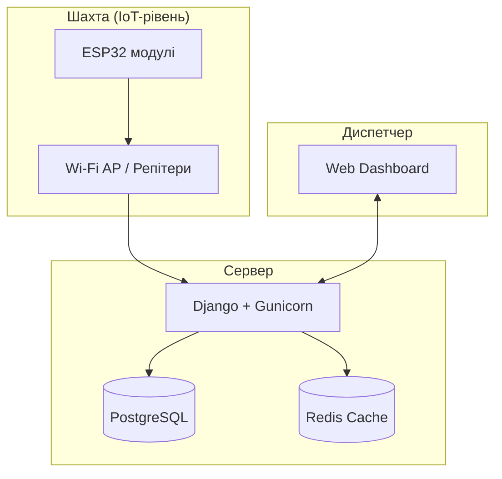
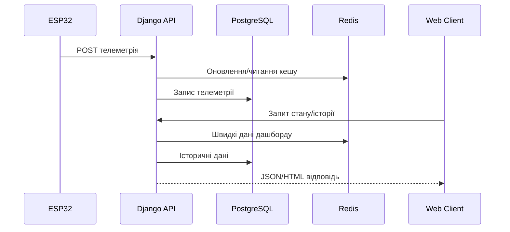

# Integrated Mine Monitoring and Safety System


## 📖 Опис

**Integrated Mine Monitoring and Safety System** — програмно-апаратний комплекс моніторингу параметрів безпеки шахти.  
Система поєднує IoT-модулі на базі ESP32, серверну обробку телеметрії, кешування, диспетчерський веб-інтерфейс та інтерактивну візуалізацію стану персоналу й інфраструктури в реальному часі.

Проєкт орієнтований на:
- безперервний моніторинг критичних параметрів;
- відмовостійкість (offline-черги на пристроях);
- відкриту модульну архітектуру без vendor lock-in;
- готовність до розгортання як у хмарі, так і на локальному сервері підприємства.

---

## 🏗️ Архітектура системи

### Back-end
- **Django (Python)** — бізнес-логіка, API, веб-рівень
- **Gunicorn** — WSGI-сервер для production
- **PostgreSQL** — основна реляційна БД
- **Redis** — кешування (через `REDIS_URL`, опційно)
- **Management Commands / Cron** — Data Lifecycle Management (очистка/архівація)

### Front-end
- **Django Templates + HTML/CSS**
- **Vanilla JavaScript** (частковий SPA-підхід)
- **Konva.js** — інтерактивна 2D-карта шахти
- **Chart.js** — аналітичні графіки

### IoT-рівень
- **ESP32** — збір телеметрії та передача на сервер
- **Wi-Fi roaming** — безшовне перемикання між AP
- **Offline queue** — локальне буферування даних при втраті зв'язку

---

## ✅ Реалізовані можливості

- Аутентифікація та ролі користувачів
- CRUD для співробітників та обладнання
- Інтерактивна 2D-карта шахти
- Моніторинг телеметрії (метан, температура, тощо)
- Система тривог (SOS/інциденти)
- Звіти та аналітика
- OTA-оновлення прошивок (staged rollout)
- Кешування гарячих даних через Redis (за наявності `REDIS_URL`)

---

## 👥 Ролі користувачів

- **Admin** — повні права керування системою
- **Dispatcher** — моніторинг персоналу, карти, тривог
- **Engineer** — управління обладнанням і техобслуговуванням
- **Observer** — режим перегляду

---

## ⚙️ Конфігурація середовища

Проєкт використовує змінні середовища з `.env`.

### Обов'язкові ключі (мінімум)
- `SECRET_KEY`
- `DEBUG`
- `DB_NAME`
- `DB_USER`
- `DB_PASSWORD`
- `DB_HOST`
- `DB_PORT`
- `ESP32_API_KEY`

### Опційні
- `REDIS_URL` — якщо задано, вмикається Redis cache backend; якщо не задано — використовується file-based cache fallback.

---

## 🧪 Локальний запуск (без Docker)

```bash
git clone https://github.com/Nazoferon/Integrated-mine-monitoring-and-safety-system.git
cd Integrated-mine-monitoring-and-safety-system

python3 -m venv venv
source venv/bin/activate
pip install -r requirements.txt

cp .env.example .env
# відредагуйте .env

python manage.py migrate
python manage.py runserver
```

Веб-інтерфейс: [http://127.0.0.1:8000](http://127.0.0.1:8000)

---

## 🐳 Docker-розгортання

У проєкті підготовлено Docker deployment pack:
- `Dockerfile`
- `docker-compose.yml`
- `docker/entrypoint.sh`
- `.env.example`
- `.dockerignore`

Повна інструкція: **[`DEPLOYMENT_DOCKER.md`](./DEPLOYMENT_DOCKER.md)**

Коротко:
```bash
cp .env.example .env
# заповнити змінні
docker compose up -d --build
docker compose logs -f web
```

---

## 🔐 Безпека (рекомендації)

- Не комітьте реальний `.env` у репозиторій
- Відкривайте назовні лише `22`, `80`, `443`
- Не відкривайте назовні `5432` (PostgreSQL) і `6379` (Redis)
- Для API пристроїв використовуйте унікальний `ESP32_API_KEY`
- У production використовуйте HTTPS та ротацію секретів

---

## 📊 Діаграма архітектури

**Рис. 1. Архітектура компонентів та логічна структура взаємодії модулів системи моніторингу.**


**Рис. 2. Потік даних**

---

## 🚀 Подальший розвиток

- Розширення аналітики та прогнозування інцидентів
- Інтеграція з промисловими сертифікованими пристроями (ATEX)
- Розширення модулів диспетчеризації
- Резервування сервісів для підвищення відмовостійкості

---

## 📜 Ліцензія

Проєкт поширюється під ліцензією [MIT](LICENSE).

---

## 👤 Автор

**Nazoferon**  
Проєкт розроблено в межах дослідження системи моніторингу параметрів безпеки шахти.
