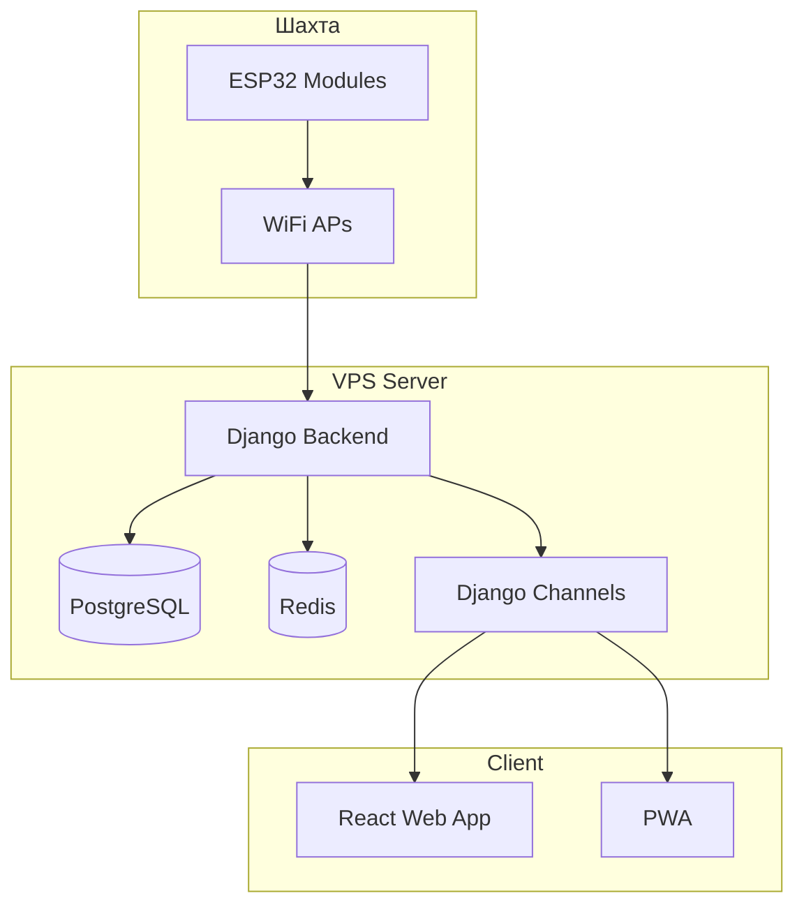
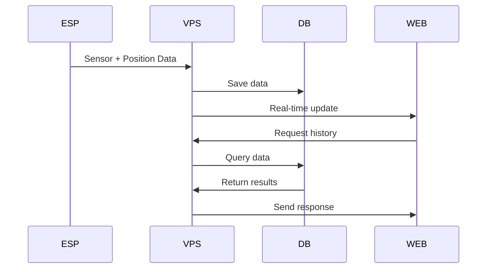

# Integrated Mine Monitoring and Safety System

## 📖 Опис
**Integrated Mine Monitoring and Safety System** — дипломний проєкт, який реалізує комплексну систему моніторингу та безпеки шахт. Вона поєднує збір даних від ESP32 модулів, управління співробітниками та обладнанням, інтерактивний конструктор карти шахти й систему сповіщень для підвищення рівня безпеки.

---

## 🎯 MVP (Minimum Viable Product)

### Критично важливі функції (Phase 1)
- Базовий веб-інтерфейс з аутентифікацією та ролями
- Управління співробітниками (CRUD)
- Простий 2D конструктор карти шахти
- ESP32 симулятор у Wokwi + підключення до VPS
- Real-time позиціювання персоналу
- Логування дій користувачів
- Адаптивний дизайн для мобільних пристроїв

### Важливі функції (Phase 2)
- Управління обладнанням
- Моніторинг показників середовища
- Система сповіщень
- Звіти та аналітика

### Додатково (за наявності часу)
- 3D візуалізація шахти
- Розширена аналітика + ML
- Інтеграція з зовнішніми системами
- Голосовий зв'язок

---

## 🏗️ Архітектура системи

### Backend
- Django (Python) — основний сервер та REST API
- Django Channels (WebSockets) — real-time оновлення
- PostgreSQL — база даних
- Redis — кешування та черги
- JWT — аутентифікація
- Docker — контейнеризація для VPS

### Frontend
- React + TypeScript — веб-клієнт
- Konva.js — 2D карта шахти
- Socket.io — WebSocket клієнт
- Material-UI — UI компоненти
- PWA — мобільна оптимізація

### ESP32
- Wokwi симуляція ESP32
- WiFi + HTTP/WebSocket для зв'язку
- JSON протокол передачі даних

---

## 👥 Ролі користувачів
- **Admin** — повні права, управління всіма ресурсами
- **Dispatcher** — моніторинг карти, співробітників, тривог
- **Engineer** — управління обладнанням, техобслуговування
- **Observer** — тільки перегляд

---

## 🗄️ Структура БД
- **User / Role / Session** — користувачі та права доступу
- **Employee / ESPModule / Assignment** — співробітники та модулі
- **MineMap / MineZone** — карта шахти
- **EmployeePosition / EnvironmentalData / EmergencySignal** — позиціювання, середовище, аварійні сигнали
- **EquipmentType / EquipmentUnit / MaintenanceLog** — обладнання та його обслуговування
- **SystemLog** — логування дій користувачів

---

## 📱 Веб-форми
- Додавання співробітників
- Призначення ESP модулів
- Додавання обладнання
- Редагування карти шахти

---

## 🔄 Робота ESP32
Модуль зчитує дані (сенсори, WiFi, SOS кнопка), формує JSON пакет і надсилає його на сервер кожні 5 секунд. Сервер відповідає статусом і може надсилати команди.

---

## 📊 Діаграми
### Архітектура


### Потік даних


---

## ✅ План реалізації MVP
- **Тиждень 1-2**: VPS, Docker, базовий Django + React, моделі БД
- **Тиждень 3-4**: CRUD для співробітників та ESP модулів, ролі
- **Тиждень 5-6**: 2D карта, симуляція ESP32, позиціювання
- **Тиждень 7-8**: Система алертів, дашборд, логування
- **Тиждень 9-10**: Тестування, оптимізація, документація

---

## 🛠️ Встановлення
```bash
git clone https://github.com/Nazoferon/Integrated-mine-monitoring-and-safety-system.git
cd Integrated-mine-monitoring-and-safety-system
python3 -m venv venv
source venv/bin/activate
pip install -r requirements.txt
python manage.py migrate
python manage.py runserver
```
Веб-інтерфейс: [http://127.0.0.1:8000](http://127.0.0.1:8000)

---

## 📌 Подальший розвиток
- Машинне навчання для прогнозування аварій
- Інтеграція з реальними сенсорами
- Мобільний застосунок
- Розширені аналітичні інструменти

---

## 📜 Ліцензія
Проєкт поширюється під ліцензією [MIT](LICENSE).

---

## 👤 Автор
**Nazoferon** — дипломний проєкт із розробки системи моніторингу шахт.
