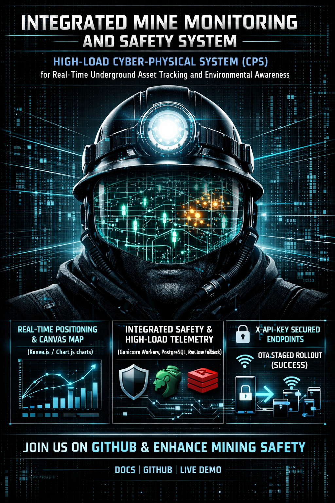
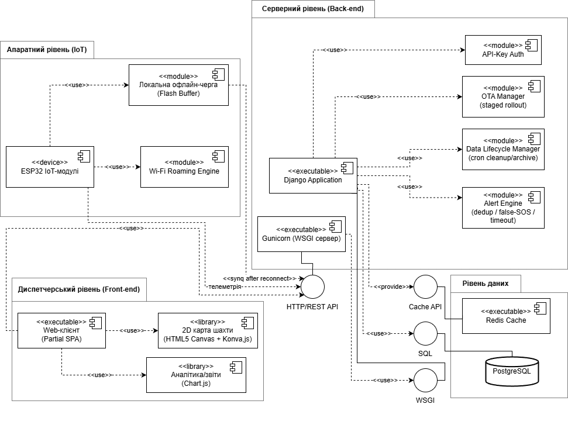
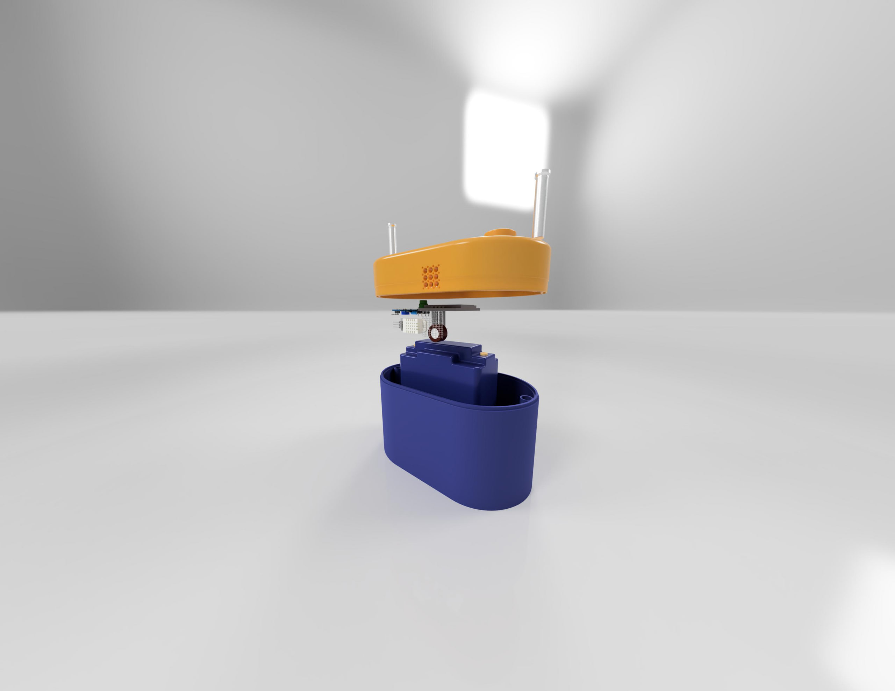
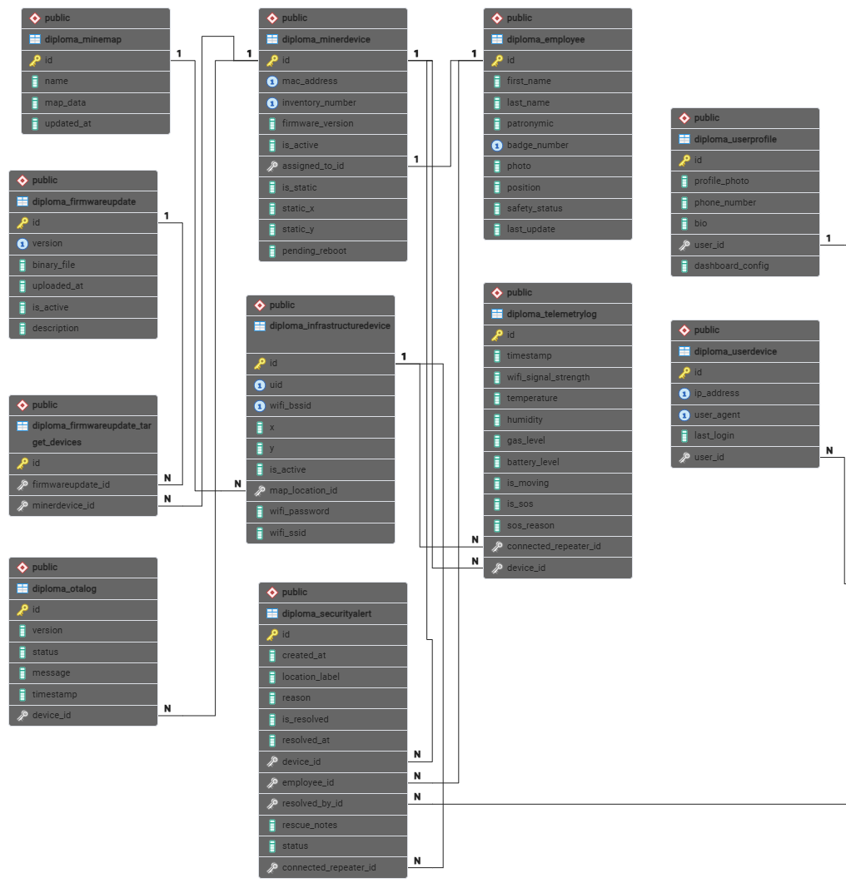
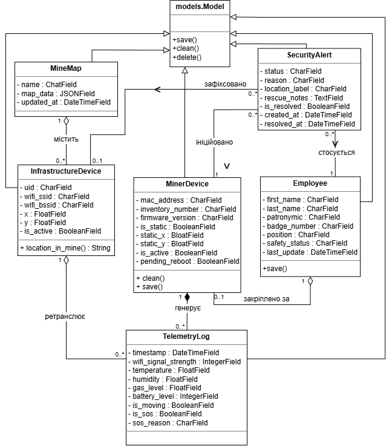
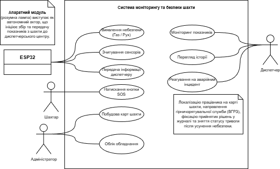

# Глибина 4.0 — Integrated Mine Monitoring and Safety System



## 📖 Опис

**«Глибина 4.0»** — це сучасний програмно-апаратний комплекс (IoT), розроблений для безперервного моніторингу параметрів безпеки в підземних виробках шахт. Система забезпечує щосекундне відстеження концентрації газів, мікроклімату та місцезнаходження персоналу в реальному часі, усуваючи проблему "vendor lock-in" через відкриту архітектуру.

Проєкт орієнтований на:
- **Критичну безпеку:** детекція викидів метану (CH₄) та чадного газу (CO).
- **Точне позиціонування:** відстеження гірників за технологією Wi-Fi RSSI.
- **Відмовостійкість:** наявність локальних офлайн-черг на пристроях при втраті зв'язку.
- **Data Lifecycle Management:** автоматична архівація та стиснення телеметрії.

---

## 🏗️ Архітектура системи

Система побудована на багаторівневій (n-tier) архітектурі, що забезпечує високу масштабованість та стабільність.



### Стек технологій
- **Back-end:** Python 3.12 / Django 5.2 (ORM, REST API, Signals).
- **Database:** PostgreSQL (BRIN-індекси для Time-Series даних) + Redis (кешування "гарячих" даних).
- **Front-end:** Vanilla JS + Konva.js (Canvas API для 2D-карти) + Chart.js.
- **IoT Level:** C++ (ESP-IDF / Arduino) для ESP32.
- **DevOps:** Docker, Docker Compose, GitHub Actions (CI/CD).

---

## 🛡️ Апаратний модуль (Hardware)

Пристрій інтегрується в стандартну шахтарську "коногонку" (індивідуальний світильник), перетворюючи її на інтелектуальний вузол безпеки.

<p align="center">
  
  
</p>

**Специфікація сенсорів:**
- **MQ-7:** Моніторинг рівня чадного газу та метану.
- **DHT22:** Вимірювання температури та вологості повітря.
- **SW-420:** Датчик вібрації (детекція падіння гірника або тривалої бездіяльності — Man Down).
- **SSD1306 OLED:** Вивід поточного статусу та аварійних попереджень.
- **Buzzer:** Звукова сигналізація при критичних рівнях небезпеки.

---

## ✅ Реалізовані можливості

- **Розумна система тривог (Smart Alert Engine):** Автоматична дедуплікація та групування повідомлень.
- **Hardware Shift Control:** Апаратний контроль завершення зміни (тільки в зоні "Лампової").
- **OTA Updates:** Бездротове оновлення прошивок за сценарієм Staged Rollout.
- **Інтерактивна 2D-карта:** Візуалізація топології штреків та руху персоналу без затримок.
- **PDF-звіти:** Генерація офіційних документів через ReportLab.
- **Безпека:** Захист від ботів (Cloudflare Turnstile) та перевірка витоків паролів (HIBP).

---

## 📊 Проєктування та База даних

Система використовує нормалізовану схему бази даних, оптимізовану для високих навантажень.

<details>
  <summary>Натисніть, щоб переглянути діаграми</summary>

  ### Схема бази даних (ERD)
  

  ### Діаграма класів
  

  ### Варіанти використання (Use-Case)
  
</details>

---

## 👥 Ролі користувачів

- **Admin** — повні права керування системою та інфраструктурою.
- **Dispatcher** — оперативний моніторинг персоналу, карти та обробка тривог.
- **Engineer** — технічне обслуговування обладнання та моніторинг OTA.
- **Observer** — режим перегляду для зовнішнього аудиту.

---

## 🧪 Запуск проєкту

### Локально
```bash
python -m venv venv
source venv/bin/activate # або venv\Scripts\activate на Windows
pip install -r requirements.txt
cp .env.example .env # Налаштуйте змінні
python manage.py migrate
python manage.py runserver
```

### Через Docker (Рекомендовано)
Детальна інструкція: [**DEPLOYMENT_DOCKER.md**](./DEPLOYMENT_DOCKER.md)
```bash
docker compose up -d --build
```

---

## 📜 Ліцензія

Проєкт поширюється під ліцензією [MIT](LICENSE).

---

## 👤 Автор

**Nazoferon**  
Розроблено в межах бакалаврської кваліфікаційної роботи на тему «Програмне забезпечення системи моніторингу параметрів безпеки шахти».